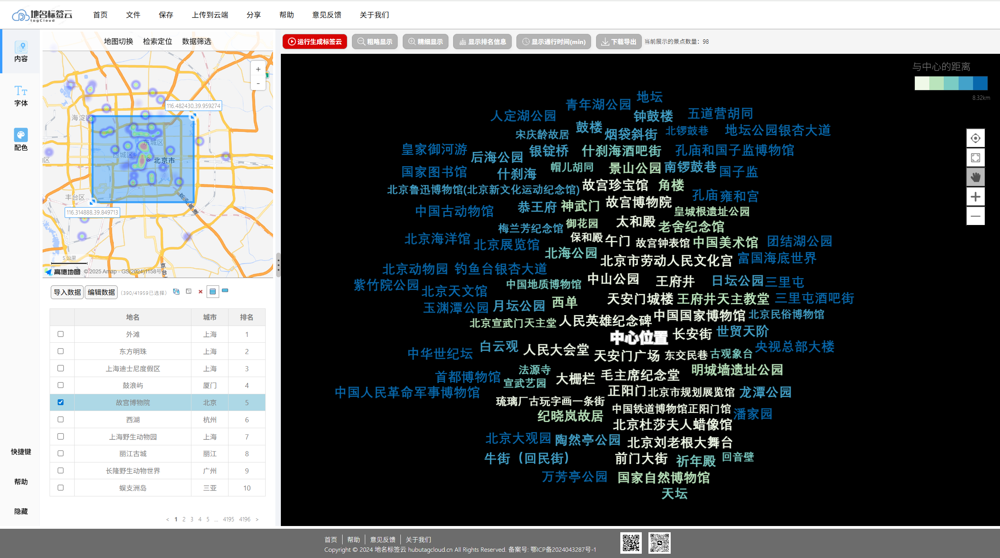
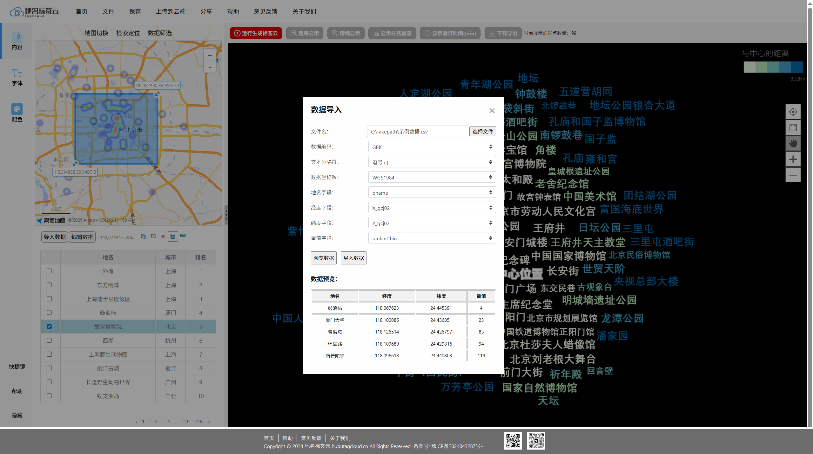
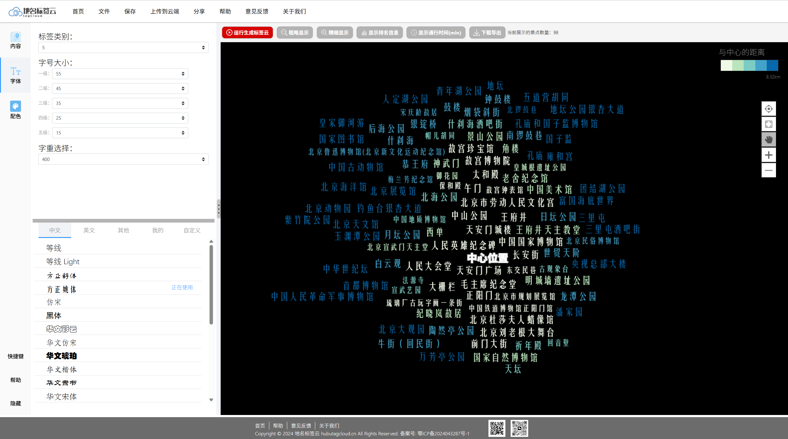
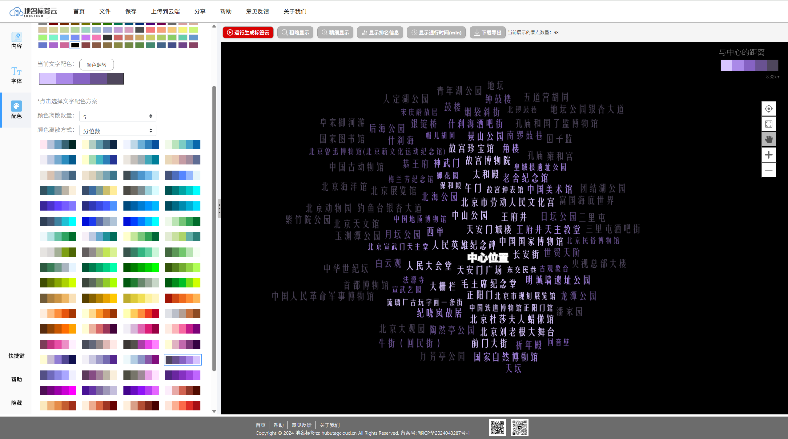
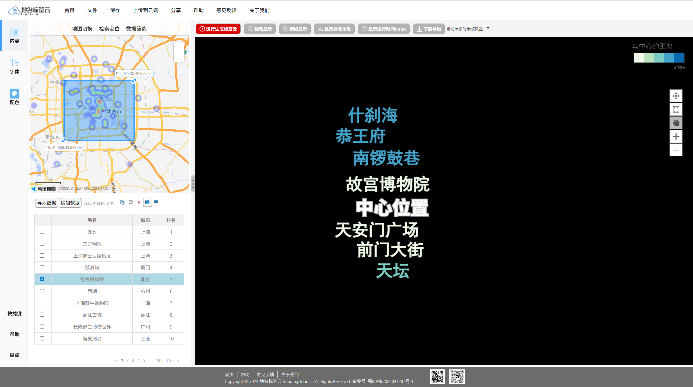
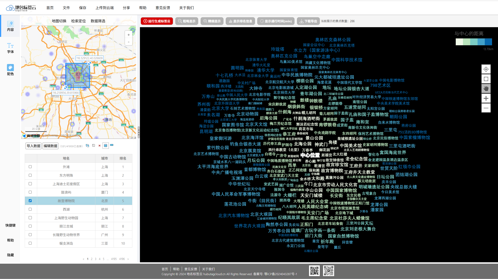
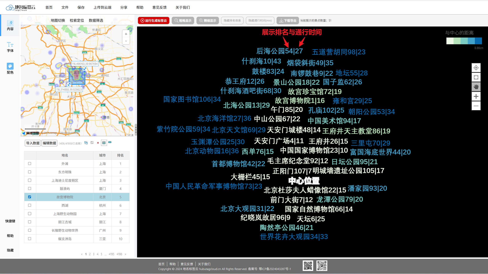
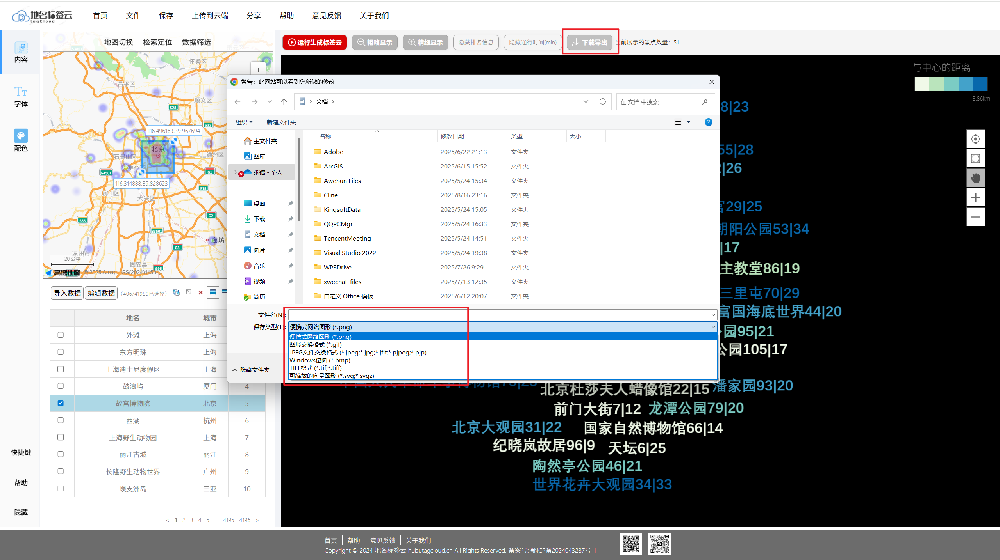

# 地名标签云（fabricTagCloud） V3.0

## 📖 项目简介

**fabricTagCloud** 是一个基于 **纯 JavaScript + Fabric.js + 高德地图 API** 的前端可视化项目，旨在提供直观的空间数据分析与可视化展示。

项目主要功能包括：

- **地图展示 POI**：左侧窗口展示 **高德地图**，在大尺度地图上用点标记 POI，在小尺度地图上则使用热力图展示 POI 的空间范围分布。

- **数据区域选择**：在【数据筛选】栏目下，提供了多种数据筛选方法，包括绘制圆形/矩形/任意多边形范围等，若是对当前范围需要修改，也支持清除绘制。在完成范围绘制后，单击【运行生成标签云】，即可自动触发地名标签云生成。

- **源数据修改**：在左下部分数据管理模块，系统初始界面将会以二维数据表的形式展示当前系统存储的兴趣点数据，系统内默认存储的是全国的景点兴趣点数据。支持对数据进行修改管理。

- **中心型标签云生成**：根据绘制的区域范围，利用 **Fabric.js** 动态生成地名标签云。

- **多尺度标签云渲染展示**：用户可以通过单击，画布上方的【粗略显示】与【精细显示】，实现对画布内渲染展示的标签数量进行控制，从而实现多尺度地名标签云渲染展示。

- **展示属性信息**：可以单击画布上方的【显示排名信息】、【显示通行时间】，增加展示标签在当前城市的排名、抵达中心位置的通行时间（分钟）。

- **标签云样式编辑**：左侧窗口栏目提供样式面板，支持实时修改标签云样式：包括字体与配色两大板块。

  - 字体板块：支持修改标签分类类别、各类别字号大小、全局字重、字体类型。
  - 配色板块：支持对背景色、文字配色方案进行修改。

- **交互性**：用户可以自由调整样式，实时查看标签云效果，便于数据可视化分析与展示。

该项目目前用于课题组业务场景，可直观展示地理空间数据与语义标签之间的关系，辅助科研分析和可视化演示。

---

## 🛠 技术栈

- **前端框架**：纯 JavaScript（Vanilla JS）
- **绘图工具**：Fabric.js
- **地图服务**：高德地图 API
- **DOM 操作**：jQuery

---

## 📂 项目结构

```text
fabricTagCloud/
│── index.html                    # 主入口
│── login_register.html           # 登录注册页面
│── help.html                     # 帮助手册页面
│── feedback.html                 # 反馈页面
│── hubuCartographicGroup.html    # 实验室介绍页面
│── css/                          # 样式文件
│── js/                           # 存放第三方库 & 自定义脚本
│ ├── modules/                    # 第三方库
│ │ ├── fabric.js                 # Fabric 第三方库
│ │ ├── jquery.js                 # jQuery 第三方库
│ ├── addRankTime.js              # 添加展示排名&时间
│ ├── amplifyreduceTagCloud.js.js # 尺度变换
│ ├── changeColor.js              # 颜色样式修改
│ ├── changeFont.js               # 字体样式修改
│ ├── changeTable.js              # 表格数据修改
│ ├── changeWindows.js            # 左右窗口拖拽、菜单切换
│ ├── feedback.js                 # 反馈页面的js事件
│ ├── getPOIs.js                  # 获取范围内的 POI 数据
│ ├── help.js                     # 帮助页面的js事件
│ ├── hubuCartographicGroup.js    # 实验室简介的js事件
│ ├── importData.js               # 数据导入
│ ├── initAMAP.js                 # 初始化高德地图
│ ├── initHead.js                 # 窗口上方按钮事件
│ ├── initTagCloud.js             # 初始化范围内的中心性标签云
│ ├── login_register.js           # 登录注册页面事件
│ ├── server.js                   # 后端服务器
│ └── showDetailsWindow.js        # 展示详情窗口
│── images/                       # 图片、图标等资源
│── json/                         # 存放 json 数据
│ └── chinapoi.json               # POI 数据
│── assets/                       # 存放 MD 文件所需的图片
│── README.md

```

---

## 🚀 运行方式

### 方式一：VSCode 插件（推荐）

1. 安装 [Live Server](https://marketplace.visualstudio.com/items?itemName=ritwickdey.LiveServer) 插件
2. 在 VSCode 中右键 `index.html` → **Open with Live Server**
3. 浏览器会自动打开项目，支持完整功能（包括高德地图 API 调用）

### 方式二：直接用浏览器打开

- 直接双击 `index.html` 或者拖到浏览器中打开  
  ⚠️ 注意：部分功能（如调用高德 API）可能会因为跨域问题而不可用。

### 方式三：Node.js 本地服务

如果已安装 **Node.js**，可以使用 http-server 运行：

```bash
npm install -g http-server
http-server .
```

默认运行在 http://localhost:8080 ，可避免跨域问题，同时更适合开发与调试。

---

## 📦 依赖

- **Fabric.js**：用于生成标签云及可视化绘图。

- **高德地图 API**：提供地图服务与地理空间数据展示。

- **jQuery**：用于 DOM 操作和事件绑定。

📌 本项目的依赖库已放在 js/ 文件夹下，无需额外下载。

---

## 💡 功能说明

### 1. 地图展示与 POI 标记

- 左侧地图窗口默认显示指定区域的地图

- POI 信息通过数据点绘制在地图上，支持点击查看详细信息

### 2. 数据区域选择

- 用户在地图上绘制圆形/矩形/多边形范围

- 单击【运行生成标签云】，触发 Fabric.js 标签云生成逻辑

- 范围质心自动作为标签云的中心点

### 3. 标签云生成

- 根据所绘制范围内的数据生成中心型标签云

- 标签根据权重或数量大小进行排布

### 4. 多尺度标签云渲染展示

- 对画布内渲染展示的标签数量进行控制，实现多尺度地名标签云渲染展示

### 5. 展示属性信息

- 增加展示标签在当前城市的排名、抵达中心位置的通行时间（分钟）

### 6. 样式编辑面板

- 支持动态修改标签云的：字体颜色、字体大小、字体类型、字重

- 面板操作即时渲染标签云，无需刷新页面

### 7. 数据管理模块【新版功能】

- 支持通过二维表管理修改数据

### 8. 可视化交互

- 标签云可拖拽、缩放

- 提供良好的交互体验，方便科研分析与演示

---

## 🖼 效果展示

### 1. 标签云效果图



### 2. 数据导入修改



### 3. 字体样式修改



### 4. 配色修改



### 4. 多尺度变换




### 5. 展示排名与通行时间



### 6. 导出图片



## 📜 License

本项目仅供学习和课题组内部使用，禁止未经授权的商用。
